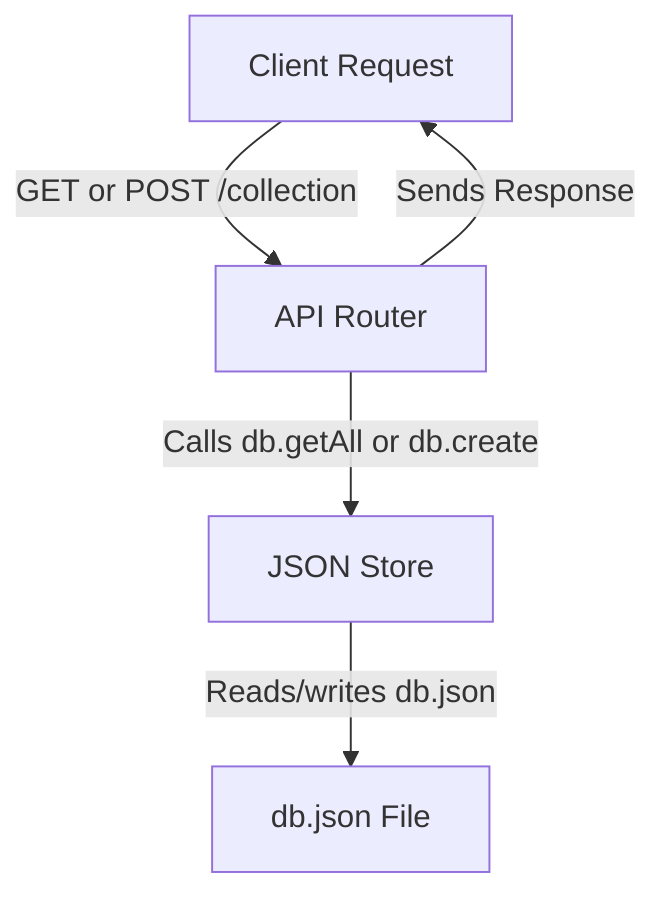
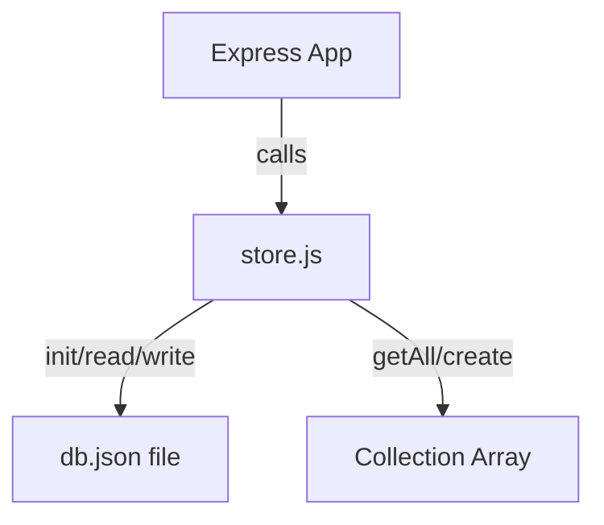
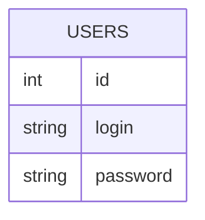

# Documentation for Express JSON DB Example

This documentation explains the codebase for a minimal Express "JSON DB" backend, a React login form, and the glue code to connect them. It covers every file, their purpose, logic, and provides detailed API endpoint docs and usage instructions.

---

## Overview

This codebase enables you to:

- Store and retrieve collections (e.g., users) in a local JSON file via REST API.
- Quickly bootstrap a backend with minimal setup.
- Use a React frontend to interact with the backend (e.g., a login form).
- Serve static files for a SPA (Single Page Application).

---

## File: `index.js`

This file exports a factory function to create an Express router for a file-backed JSON database.

### Purpose

- **Initializes the database file** if missing.
- **Sets up middleware** for JSON parsing.
- **Mounts RESTful API routes** for collections via `createRouter`.

### Code

```js
import express from "express"
import store from "./store.js"
import createRouter from "./router.js"

export default function jsonDB(filePath) {
  const router = express.Router()
  const db = store(filePath)
  ;(async () => { await db.init() })()
  router.use(express.json())
  router.use(createRouter(db))
  return router
}
```

### Key Points

- **`jsonDB(filePath)`** returns an Express router using the JSON file at `filePath` for storage.
- **`db.init()`** ensures the DB file exists.
- **All REST endpoints are mounted under this router.**

---

## File: `router.js`

This file defines REST API routes for CRUD operations on collections in the JSON DB.

### Purpose

- **Expose endpoints** to get and create items in any collection (e.g., `/users`, `/posts`).

### Code

```js
import { Router } from "express"
export default function createRouter(db) {
  const router = Router()
  // GET
  router.get("/:collection", async (req, res) => {
    const { collection } = req.params
    const items = await db.getAll(collection)
    res.json(items)
  })
  // POST
  router.post("/:collection", async (req, res) => {
    const { collection } = req.params
    const data = req.body
    try {
      const item = await db.create(collection, data)
      return res.status(201).json({ message: 'Created', data: item })
    } catch (err) {
      return res.status(500).json({ error: 'Failed to create item' })
    }
  })
  return router
}
```

### Endpoints Exposed

- `GET /:collection` — List all items in a collection.
- `POST /:collection` — Add an item to a collection.

---

### REST API Flow



---

### API Endpoints

#### Get All Items in a Collection

##### GET /api/:collection

```api
{
  "title": "Get All Items in Collection",
  "description": "Returns an array of all items in the specified collection.",
  "method": "GET",
  "baseUrl": "http://localhost:8080",
  "endpoint": "/api/users",
  "headers": [],
  "queryParams": [],
  "pathParams": [
    {
      "key": "collection",
      "value": "Collection name (e.g., users)",
      "required": true
    }
  ],
  "bodyType": "none",
  "requestBody": "",
  "responses": {
    "200": {
      "description": "List of items",
      "body": "[ { \"id\": 1, \"login\": \"w\", \"password\": \"wцц\" }, { \"id\": 2, \"login\": \"ц\", \"password\": \"цццекптук\" } ]"
    }
  }
}
```

---

#### Create an Item in a Collection

##### POST /api/:collection

```api
{
  "title": "Create Item in Collection",
  "description": "Creates a new item in the specified collection and returns the created object.",
  "method": "POST",
  "baseUrl": "http://localhost:8080",
  "endpoint": "/api/users",
  "headers": [
    {
      "key": "Content-Type",
      "value": "application/json",
      "required": true
    }
  ],
  "queryParams": [],
  "pathParams": [
    {
      "key": "collection",
      "value": "Collection name (e.g., users)",
      "required": true
    }
  ],
  "bodyType": "json",
  "requestBody": "{\n  \"login\": \"newuser\",\n  \"password\": \"secret\"\n}",
  "responses": {
    "201": {
      "description": "Created",
      "body": "{\n  \"message\": \"Created\",\n  \"data\": {\n    \"id\": 3,\n    \"login\": \"newuser\",\n    \"password\": \"secret\"\n  }\n}"
    },
    "500": {
      "description": "Error creating item",
      "body": "{\n  \"error\": \"Failed to create item\" \n}"
    }
  }
}
```

---

## File: `store.js`

Handles file-based database operations.

### Purpose

- **Initialize the DB file** if missing.
- **Read/write** the whole database (JSON) file.
- **Get all items** from a collection.
- **Add a new item** to a collection, auto-incrementing the ID.

### Code

```js
import fs from "fs/promises"
export default function store(filePath) {
  async function init() {
    try {
      await fs.access(filePath)
    } catch {
      await fs.writeFile(filePath, JSON.stringify({}, null, 2))
    }
  }
  async function read() {
    const data = await fs.readFile(filePath, "utf-8")
    return JSON.parse(data)
  }
  async function write(db) {
    await fs.writeFile(filePath, JSON.stringify(db, null, 2))
  }
  async function getAll(collection) {
    try {
      const db = await read()
      return db[collection] ?? []
    } catch {
      return []
    }
  }
  async function create(collection, data) {
    let db
    try {
      db = await read()
    } catch {
      db = {}
    }
    db[collection] = db[collection] ?? []
    const nextId = db[collection].reduce((max, it) => {
      const maybeId = typeof it?.id === "number" ? it.id : 0
      return Math.max(max, maybeId)
    }, 0) + 1
    const item = { id: nextId, ...data }
    db[collection].push(item)
    await write(db)
    return item
  }
  return { init, getAll, create }
}
```

### Features

- **Robust:** Initializes DB file if missing.
- **Atomic:** Always reads/writes the full file.
- **Auto-increment:** Generates unique `id` for each item.

---

### Data Flow



---

## File: `Login.jsx`

A React component for a user login form. Demonstrates how the frontend interacts with the backend.

### Purpose

- **Collects user input** for login and password.
- **Sends a POST request** to `/api/users` to save user data.
- **Displays status messages** based on the operation result.

### Code

```jsx
import { useState } from "react";
export default function Login() {
  const [login, setLogin] = useState("");
  const [password, setPassword] = useState("");
  const [status, setStatus] = useState("");
  const handleSave = async () => {
    if (!login || !password) {
      setStatus("Both fields are required.");
      return;
    }
    setStatus("Saving...");
    try {
      const res = await fetch("/api/users", {
        method: "POST",
        headers: { "Content-Type": "application/json" },
        body: JSON.stringify({ login, password }),
      });
      const json = await res.json();
      if (json.error) {
        setStatus(json.error);
      } else {
        setStatus("Saved to db.json ✅");
        console.log("Created/updated user:", json.data);
        setLogin("");
        setPassword("");
      }
    } catch (err) {
      setStatus("Network error");
    }
  };
  return (
    <div>
      <h1>Login Form</h1>
      <input placeholder="login" value={login} onChange={(e) => setLogin(e.target.value)} />
      <input type="password" placeholder="password" value={password} onChange={(e) => setPassword(e.target.value)} />
      <button onClick={handleSave}>Save Data</button>
      <p>{status}</p>
    </div>
  );
}
```

### How it Works

- **User fills in login and password.**
- **On button click:** Calls `handleSave`, sends data to backend.
- **Status message** shows result or error.
- **Fields are cleared** after successful save.

---

## File: `server.js`

The main entry point for the backend server.

### Purpose

- **Creates an Express app.**
- **Mounts the JSON DB API** under `/api` using the local `db.json`.
- **Serves static files** from the SPA build output (`dist/`).
- **Fallbacks:** For all non-API routes, serves `index.html` (SPA support).

### Code

```js
import express from "express"
import path from "path"
import { fileURLToPath } from "url"
import jsonDB from "../../src/index.js"

const __filename = fileURLToPath(import.meta.url)
const __dirname = path.dirname(__filename)
const app = express()

app.use(express.json())

// Mount API under /api, use the app-local db.json
app.use("/api", jsonDB(path.join(__dirname, "db.json")))

// Serve static files from Vite build output (dist)
const distDir = path.join(__dirname, "dist")
app.use(express.static(distDir))

// SPA fallback — serve index.html for all non-API routes
app.use((req, res, next) => {
  if (req.path.startsWith('/api')) return next()
  res.sendFile(path.join(distDir, 'index.html'))
})

app.listen(8080, () => {
  console.log("Server running on http://localhost:8080")
})
```

### Features

- **API and frontend served together.**
- **SPA routing supported.**
- **Easy local development.**

---

## File: `db.json`

This file is the local database that stores all collections as arrays.

### Current Example Content

```json
{
  "users": [
    { "id": 1, "login": "w", "password": "wцц" },
    { "id": 2, "login": "ц", "password": "цццекптук" }
  ]
}
```

### Structure

- Top-level keys are collection names (e.g., `"users"`).
- Each collection is an array of objects.
- Each object has an `id` and arbitrary fields.

---

### Entity Relationship



---

# How to Use This Library

Follow these steps to get started with the Express JSON DB library:

## Installation

1. **Clone** or download the repository with the above files.
2. Ensure you have **Node.js** (v16+) installed.

## Setup

1. From your project root, **install dependencies**:

   ```bash
   npm install express
   ```

2. Place your SPA build (e.g., Vite/React) output in the `dist/` folder (next to `server.js`).

3. Ensure `db.json` exists, or let the app initialize it.

## Running the Server

Start the backend server:

```bash
node server.js
```

- The API will be available at `http://localhost:8080/api/`.
- The frontend will be served from `http://localhost:8080/`.

## Using the API

- **Get all users:**
  - `GET http://localhost:8080/api/users`
- **Create a user:**
  - `POST http://localhost:8080/api/users`
  - JSON body: `{ "login": "myuser", "password": "secret" }`

## Using the React Login Form

- Use the provided `Login.jsx` in your React SPA.
- On submit, it will save user credentials to `db.json` via the backend.

---

```card
{
  "title": "Production Use Warning",
  "content": "This JSON DB approach is suitable for prototypes or small apps. It is not secure for real user authentication or production use."
}
```

---

## FAQ

### Can I add new collections?

- Yes! Just POST to `/api/mycollection` — a new array will be created automatically.

### How do I reset the database?

- Delete `db.json` — it will be recreated empty.

### How do I add more fields?

- POST objects with any shape; new fields are stored as given.

---

```card
{
  "title": "Best Practice",
  "content": "Do not store plaintext passwords in production. Use proper authentication and hashing for real-world apps."
}
```

---

## Summary Table

| File         | Purpose                                         |
|--------------|-------------------------------------------------|
| `index.js`   | Provides Express router for file-backed DB      |
| `router.js`  | Defines REST API routes for collections         |
| `store.js`   | Handles file I/O, collection operations         |
| `Login.jsx`  | React login form posting to `/api/users`        |
| `server.js`  | Runs Express app, serves API & SPA frontend     |
| `db.json`    | Stores data as a JSON object                    |

---

```card
{
  "title": "Quick Start",
  "content": "Start the server, POST to /api/users, and your data is saved in db.json instantly!"
}
```